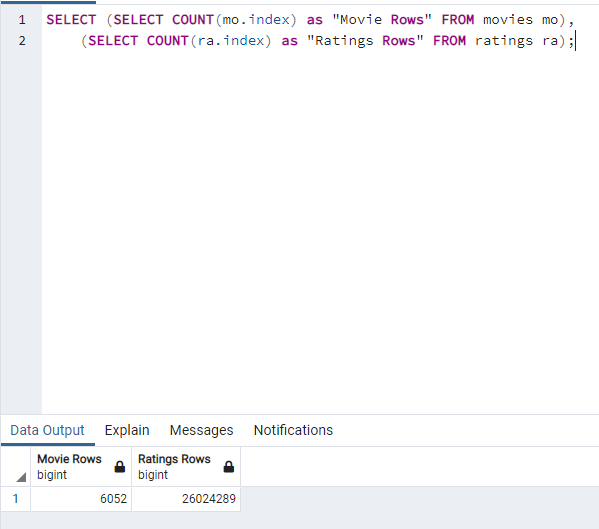

# Movies - Extract, Transform, Load Exercise
## Summary
Not much to say about this one - the challenge was mostly completed during the module.  Below are some minor changes I made to the final product.
## Deliverable #2
In Deliverable #2, steps 20 and 21, both screenshots show a total of 23 different columns.  However, of the 4 columns we cleaned and created (box_office, budget, release_date, running_time), only 2 of them had the original columns ("Box office" and "Running time") dropped from the DataFrame.  The other 2 columns ("Budget" and "Release date") remain and are duplicated in the screenshot for step 21.  I decided to drop the two extra columns as well, so my results for Deliverable #2 have only 21 columns, for that reason.
## Deliverable #4 - Query
I decided to write a query to display both row counts at once.  The query is written as a SELECT statement of two independent SELECT statements, as putting the tables in a single SELECT statement with "FROM movies, ratings" would cause an implicit join, which was overloading my computer's capabilities (or just taking forever).

